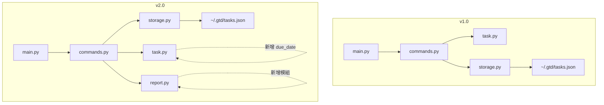

# 📋 GTD Task Manager

> 一個遵循 GTD（Getting Things Done）方法論的 CLI 任務管理工具，從 v1.0 到 v2.0 的完整 Spec-Driven Development 實作紀錄。

---

## 目錄

1. [專案簡介](#1-專案簡介)
2. [v1.0 設計決策](#2-v10-設計決策-design-decisions)
3. [v2.0 實作說明](#3-v20-實作說明)
4. [向下相容性實作細節](#4-向下相容性實作細節)
5. [架構演化比較](#5-架構演化比較)
6. [環境需求與執行方式](#6-環境需求與執行方式)
7. [已知限制與未來改進方向](#7-已知限制與未來改進方向)

---

## 1. 專案簡介

### v1.0 功能描述與設計動機

GTD Task Manager v1.0 實作了 David Allen「Getting Things Done」方法論的核心循環：**捕捉 → 澄清 → 組織 → 執行**。

使用者痛點很具體：大多數 todo app 太複雜，反而讓人花更多時間管理工具本身，而不是完成任務。GTD Task Manager 刻意保持 CLI 介面的極簡風格，讓任務的流動狀態清晰可見（`inbox → next-action → done`），符合 GTD「讓系統替你記憶」的核心理念。

v1.0 提供完整的任務 CRUD：
- `add`：快速捕捉任務至 inbox
- `list`：支援多維度篩選（狀態、專案、優先度）
- `update`：修改任務屬性
- `check`：一鍵標記完成
- `remove`：刪除任務
- `show`：查看完整細節

### 從 v1.0 到 v2.0 的演化摘要

v2.0 根據 Agent 自動產生的需求規格（`v2/requirements_v2.md`），在 v1.0 基礎上疊加四項新能力：

| 需求 | 變動方向 |
|---|---|
| **截止日期支援** | `add`/`update` 新增 `--due`、`--no-due`；`show` 新增 Due 欄位 |
| **`list` 到期篩選與視覺警示** | 新增 `--due-before` 篩選；逾期任務加 ⚠️ 標記 |
| **`report` 工作回顧報告** | 全新頂層指令，輸出整體概覽、專案分布、逾期警示 |
| **`remove` 批次刪除與確認機制** | 支援多 ID、互動確認、`--force` 跳過確認 |

整體架構變動極小：v1.0 的四個模組（`main.py`、`commands.py`、`storage.py`、`task.py`）全數保留，v2.0 僅新增一個 `report.py` 模組，並對既有模組做最小幅度的擴充。

---

## 2. v1.0 設計決策（Design Decisions）

> 這一節說明在不知道 v2.0 需求的情況下，我在 v1.0 設計時做了哪些**刻意的前瞻性決策**，以及事後這些決策如何幫助 v2.0 的實作。

### 決策一：選擇 `click` 而非 `argparse`

**理由**：`click` 使用 decorator 宣告式定義指令，每個指令獨立為函式，天然支援「只新增不修改」的擴充模式。`argparse` 的集中式 parser 設計在新增大量子指令時容易造成 if-else 蔓延。

**對 v2.0 的幫助**：v2.0 新增 `report` 指令和在 `remove`、`update` 加入新 flag，只需在對應函式上加 `@click.option()`，完全不影響其他指令的定義，改動局部且可預測。

### 決策二：將資料存取邏輯獨立為 `storage.py`

**理由**：資料儲存格式是最容易因版本演化而改變的部分。若把 `json.load()`/`json.dump()` 直接寫在 `commands.py` 裡，未來要換 SQLite 或其他後端，需要大範圍重構。獨立出 `TaskStorage` 類別，讓上層邏輯只呼叫 `load_tasks()` / `save_tasks()`，完全不感知底層格式。

**對 v2.0 的幫助**：v2.0 需求雖未要求換資料庫，但 `storage.py` 的介面設計讓 `from_dict` 加入向下相容邏輯（`data.get("due_date")` 缺少時回傳 `None`）只需改一個地方，不需動到 `commands.py` 或 `main.py`。

### 決策三：`Task` 類別使用 `to_dict()` / `from_dict()` 序列化介面

**理由**：若直接存取 `task.__dict__`，新增欄位時 JSON 序列化會自動帶出，但反序列化（讀取舊格式）就會出問題。明確實作 `from_dict` 讓我可以為每個欄位單獨控制預設值和向下相容邏輯。

**對 v2.0 的幫助**：加入 `due_date` 欄位時，`from_dict` 加一行 `data.get("due_date")` 即可，v1.0 產生的 JSON（無此欄位）自動被讀作 `None`，完美實現向下相容，零崩潰。

### 決策四：`commands.py` 使用 `TaskManager` 類別而非全域函式

**理由**：把 `TaskManager` 設計為持有 `storage` 依賴的類別，而非用全域變數，讓測試時可以注入 mock storage，也讓未來添加新功能時有清晰的封裝邊界。

**對 v2.0 的幫助**：v2.0 新增 `remove_tasks()`（批次刪除）和 `get_overdue_tasks()` 只需在 `TaskManager` 上新增方法，不影響既有方法。`generate_report()` 也是如此，委派給新模組 `report.py` 處理，`TaskManager` 只是橋接。

### 決策五：JSON 格式使用 `{"tasks": [...], "next_id": N}` 而非純陣列

**理由**：若直接存純陣列，`next_id` 就必須每次 `max(ids) + 1` 計算，若任務全被刪除會回到 1（ID 重複風險）。獨立儲存 `next_id` 確保 ID 嚴格遞增，不受刪除影響。

**對 v2.0 的幫助**：v2.0 加入批次刪除後，此設計確保即使一次刪除多個任務，下一個 ID 仍然正確，不需改動儲存邏輯。

### 決策六：`list` 預設只顯示 `inbox` 和 `next-action`，而非全部任務

**理由**：GTD 方法論中，`done` 是封存狀態，日常查看任務清單不應被已完成任務干擾。需要看全部時用 `--all`，這是符合 GTD 使用習慣的設計。

**對 v2.0 的幫助**：v2.0 加入 `--due-before` 篩選時，此過濾邏輯已存在，只需疊加日期條件，不需重構排序和顯示邏輯。

### 決策七：錯誤訊息統一 `❌ Error:` 前綴與退出碼規範

**理由**：一致的錯誤格式讓自動化測試和腳本可以可靠地偵測錯誤（grep `Error:` 或檢查 exit code），也讓使用者能一眼識別問題類型。

**對 v2.0 的幫助**：需求規格明確要求「錯誤訊息格式應與 v1.0 保持一致」，由於 v1.0 已有統一規範，v2.0 所有新指令自然沿用，無需額外協調。

---

## 3. v2.0 實作說明

### 如何閱讀與理解 v2.0 需求

Agent 產生的 `requirements_v2.md` 以 PRD 口吻撰寫，模擬真實客戶語氣，有幾個關鍵資訊需要仔細解析：

1. **「v1.0 所有指令介面均不可更動」**：這是最高優先級約束，確認我不能刪或改任何既有參數。
2. **每個需求末尾有「驗收標準」段落**：這等同於測試案例，我把它們逐一轉換成具體的 CLI 指令進行手動驗證。
3. **「日期格式由學生自行決定」**：這是規格留白，我選擇 `YYYY-MM-DD`（ISO 8601），因為它排序友好且 Python `date.fromisoformat()` 可直接解析。

### 將 v2.0 需求映射到 SDD

| 需求 | SDD 對應 | 實作位置 |
|---|---|---|
| `add --due` | 新增 CLI option，`task.py` 新增 `due_date` 欄位 | `main.py`, `task.py` |
| `update --due` / `--no-due` | 新增兩個互斥 flag | `main.py`, `commands.py` |
| `show` 顯示 Due | 輸出格式新增一行 | `main.py` |
| `list --due-before` | 新增篩選條件 | `main.py`, `commands.py` |
| `list` 逾期警示 ⚠️ | 排序邏輯調整 + 顯示條件判斷 | `commands.py`, `main.py` |
| `report` 指令 | 全新指令 + 新模組 | `main.py`, `report.py` |
| `remove` 批次 + 確認 | 既有指令擴充 | `main.py`, `commands.py` |

### 非顯而易見的實作選擇

#### `list` 排序邏輯設計

需求說「排序規則由學生自行設計」，我的設計邏輯是：

```
排序鍵（優先級由高到低）：
1. is_overdue（True 排前，即逾期任務最優先）
2. -priority（優先度高的先出現）
3. due_date（截止日近的先出現，None 排最後）
4. id（同等條件下 ID 小的先出現）
```

這個設計反映 GTD 的緊急性判斷邏輯：逾期任務最需要立刻處理，其次是優先度高的任務，最後才是沒有截止日期的任務。

#### `--due` 和 `--no-due` 互斥設計

在 `update` 指令中，`--due` 和 `--no-due` 同時傳入是無意義的操作，程式在入口處明確檢查並報錯：

```python
if due is not None and clear_due:
    click.echo("❌ Error: Cannot specify both --due and --no-due", err=True)
    sys.exit(2)
```

這比讓 click 做隱性處理更清楚，符合「明確比隱含好」的原則。

#### `remove` 的分階段確認流程

需求要求「部分 ID 不存在時詢問是否繼續」，我設計成兩階段互動：

1. 先報告哪些 ID 找不到
2. 詢問是否繼續刪除找得到的部分
3. 再次確認即將被刪除的任務清單
4. 最後彙總輸出結果

`--force` 模式跳過所有互動，適合腳本自動化。這個設計讓互動模式有完整的安全網，同時不犧牲腳本使用的便利性。

#### `report.py` 獨立模組

報告生成邏輯（統計、格式化）與指令業務邏輯（CRUD）屬於不同關切點，因此獨立為 `report.py`，`TaskManager.generate_report()` 只是委派呼叫。這讓日後修改報告格式（例如加入顏色、改用表格）不需動到 `commands.py`。

---

## 4. 向下相容性實作細節

### v1.0 介面完整保留清單

| v1.0 指令與參數 | v2.0 行為 | 相容性 |
|---|---|---|
| `add --title TEXT` | 行為不變 | ✅ |
| `add --project TEXT` | 行為不變 | ✅ |
| `add --priority INT` | 行為不變 | ✅ |
| `list` | 行為不變，表格新增 Due 欄 | ✅ |
| `list --status TEXT` | 行為不變 | ✅ |
| `list --project TEXT` | 行為不變 | ✅ |
| `list --priority INT` | 行為不變 | ✅ |
| `list --all` | 行為不變 | ✅ |
| `update --id INT` | 行為不變 | ✅ |
| `update --title TEXT` | 行為不變 | ✅ |
| `update --project TEXT` | 行為不變 | ✅ |
| `update --no-project` | 行為不變 | ✅ |
| `update --priority INT` | 行為不變 | ✅ |
| `update --status TEXT` | 行為不變 | ✅ |
| `check --id INT` | 行為不變 | ✅ |
| `remove --id INT` | 行為擴充（加入確認步驟），但單一 ID 的最終結果相同 | ✅ |
| `show --id INT` | 行為不變，輸出新增 Due 行 | ✅ |

### JSON 格式向下相容

v1.0 的 `tasks.json` 沒有 `due_date` 欄位，v2.0 的 `Task.from_dict()` 用 `data.get("due_date")` 讀取，缺少時回傳 `None`，不會報錯：

```python
# v2/task.py - from_dict
due_date_str = data.get("due_date")   # v1 tasks 沒有此欄位，回傳 None
if due_date_str:
    task.due_date = date.fromisoformat(due_date_str)
else:
    task.due_date = None
```

這讓 v1.0 產生的 `tasks.json` 可以直接被 v2.0 讀取，零遷移成本。

### `remove` 的相容性說明

v1.0 的 `remove --id N` 是無確認直接刪除；v2.0 加入互動確認。這在介面行為上是一個微妙的變動，但：

- 最終效果（任務被刪除）完全相同
- 加入 `--force` flag 可還原 v1.0 的無確認行為：`remove --id N --force`
- 自動化腳本只需加 `--force` 即可保持原有行為

這個設計讓 v2.0 對人工使用更安全，對腳本使用完全向下相容。

---

## 5. 架構演化比較

### 模組結構對比



### 量化比較

| 面向 | v1.0 | v2.0 | 變動 |
|---|---|---|---|
| 模組數量 | 4（含 `__init__`） | 5（含 `__init__`） | +1（`report.py`） |
| 總程式碼行數 | ~358 行 | ~634 行 | +276 行（+77%） |
| CLI 指令數 | 6 | 7 | +1（`report`） |
| 資料欄位數 | 7 | 8 | +1（`due_date`） |
| 儲存格式 | JSON | JSON（不變） | 無變動 |
| CLI Library | click 8.1.7 | click 8.1.7（不變） | 無變動 |
| 相依套件數 | 1 | 1（不變） | 無變動 |

### 各模組變動量

| 模組 | v1.0 行數 | v2.0 行數 | 變動說明 |
|---|---|---|---|
| `task.py` | 62 | 73 | 新增 `due_date` 欄位與序列化邏輯 |
| `storage.py` | 47 | 49 | 幾乎不變，`from_dict` 向下相容邏輯已在 `task.py` |
| `commands.py` | 87 | 159 | 新增 `remove_tasks()`、`generate_report()`、`get_overdue_tasks()`、排序邏輯更新 |
| `main.py` | 162 | 281 | 新增 `report` 指令、`remove` 擴充、`add`/`update`/`list` 加新 options |
| `report.py` | — | 72 | 全新模組 |

---

## 6. 環境需求與執行方式

### 系統需求

- Python 3.10+
- pip

### 安裝方式

#### 方式一：直接執行（無需安裝）

```bash
# v1.0
cd v1/
pip install -r requirements.txt
python main.py --help

# v2.0
cd v2/
pip install -r requirements.txt
python main.py --help
```

#### 方式二：安裝為全域 CLI 指令（`gtd`）

```bash
# 在專案根目錄
pip install -e .

# 安裝後可在任何目錄使用
gtd --help
```

> ⚠️ `setup.py` 的 entry point 需指向 `v2.main:cli`：
> ```python
> "gtd=v2.main:cli"
> ```

### 任務資料儲存位置

任務儲存於 `~/.gtd/tasks.json`，程式首次執行時自動建立。

### 常用指令速查

```bash
# 新增任務
gtd add --title "完成作業" --project "課程" --priority 4 --due 2026-03-31

# 列出任務（預設只顯示 inbox 和 next-action）
gtd list

# 列出所有任務（含 done）
gtd list --all

# 篩選即將到期的任務
gtd list --due-before 2026-04-01

# 更新任務
gtd update --id 1 --status next-action --due 2026-04-15

# 清除截止日期
gtd update --id 1 --no-due

# 標記完成
gtd check --id 1

# 查看任務詳情
gtd show --id 1

# 刪除任務（互動確認）
gtd remove --id 1

# 批次刪除（跳過確認）
gtd remove --id 1 --id 2 --id 3 --force

# 產生工作回顧報告
gtd report

# 產生特定專案報告
gtd report --project "課程"
```

---

## 7. 已知限制與未來改進方向

### 已知限制

#### 效能限制
- 每次操作都完整讀寫 `tasks.json`，任務數量超過數千筆後會有明顯延遲
- 沒有 index，`list --project` 需要全表掃描

#### 功能限制
- `list` 的排序方式固定，無法讓使用者自訂排序欄位
- `report` 沒有時間範圍篩選（例如「只看本週」）
- 沒有任務的 undo 機制，誤刪無法復原
- 截止日期只支援日期（`date`），不支援時間（`datetime`）

#### 可用性限制
- Windows PowerShell 中 `--project ""` 會被 shell 吃掉，需用 `--no-project` 替代
- 多使用者或多設備間無法同步（資料存在本機 `~/.gtd/`）

### 若有 v3.0，會這樣設計

#### 儲存層升級：SQLite
當任務量超過千筆，JSON 全量讀寫的效能問題會明顯。v3.0 會將 `storage.py` 換成 SQLite 後端，並利用 v2.0 就已存在的 `TaskStorage` 介面隔離，上層邏輯幾乎不需改動。

#### 重複性任務（Recurring Tasks）
GTD 中有大量每日/每週的例行任務，目前需要手動重新建立。v3.0 可在 `task.py` 新增 `recurrence` 欄位（`daily`、`weekly`、`monthly`），搭配 `check` 指令自動生成下一筆任務。

#### TUI 介面（Terminal UI）
使用 `rich` 或 `textual` 建立互動式 TUI，讓使用者可以用方向鍵導覽任務、快捷鍵更新狀態，同時保留所有現有 CLI 指令的向下相容性。

#### 子任務（Subtasks）
複雜任務需要拆解成步驟，可在 `task.py` 新增 `parent_id` 欄位，讓任務形成樹狀結構，`list` 指令加入縮排顯示。

#### 自動備份
在每次 `save_tasks()` 前自動備份 `tasks.json`，解決誤刪無法復原的問題。

---

## 附錄：v1.0 測試案例驗證表

以下為 `sdd_v1.md` 定義的測試案例，在 v2.0 下的實際驗證結果：

| # | 指令 | v2.0 結果 | 相容性 |
|---|---|---|---|
| T1 | `add --title "Task A"` | `✅ Added: [1] Task A (Priority: 3)` | ✅ |
| T2 | `add --title "Task B" --project "Work" --priority 5` | `✅ Added: [2] Task B (Project: Work, Priority: 5)` | ✅ |
| T3 | `list`（優先度排序） | Task B（P5）在上，Task A（P3）在下 | ✅ |
| T4 | `list --status inbox` | 顯示兩個 inbox 任務 | ✅ |
| T5 | `list --project "Work"` | 只顯示 Task B | ✅ |
| T6 | `update --id 1 --status next-action` | `✅ Updated: [1] Task A` | ✅ |
| T7 | `update --id 1 --priority 4 --title "Task A - Updated"` | `✅ Updated: [1] Task A - Updated` | ✅ |
| T8 | `show --id 1` | 完整欄位輸出（含新增的 Due 行） | ✅ |
| T9 | `check --id 2` | `✅ Completed: [2] Task B` | ✅ |
| T10 | `list --all` | 顯示 done 和 next-action 任務 | ✅ |
| T11 | `remove --id 2`（互動確認後） | `✅ Removed: [2]` | ✅ |
| T12 | `show --id 999` | `❌ Error: Task [999] not found`，exit 1 | ✅ |
| T13 | `add --project "Personal"`（無 title） | `❌ Error: --title is required`，exit 2 | ✅ |
| T14 | `add --title "Task C" --priority 6` | `❌ Error: Priority must be between 1 and 5`，exit 2 | ✅ |
| T15 | `update --id 1 --status invalid-status` | `❌ Error: Invalid status...`，exit 1 | ✅ |
| T16 | `--help` | 列出所有指令（含新增的 report） | ✅ |
| T17 | `add --help` | 顯示 --title、--project、--priority、--due | ✅ |
| T18 | `list --priority 5` | 顯示優先度 5 的任務 | ✅ |
| T19 | `list`（不帶篩選） | 只顯示 inbox 和 next-action | ✅ |
| T20 | `update --id 1 --no-project` | `✅ Updated: [1] ...`，project 設為 null | ✅ |

**全部 20 項測試案例通過** ✅

---

*README 撰寫日期：2026-03-25*
*學生：Jadiouo*
