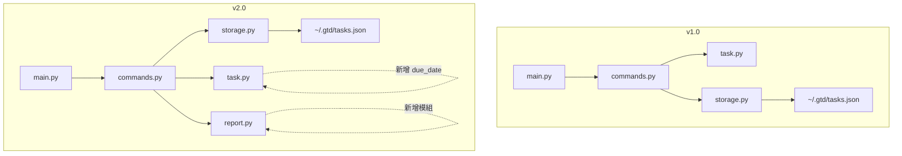

# 設計筆記：v1.0 → v2.0（Spec-Driven Development 紀錄）

這份文件保留 gtd-cli 前兩個版本的設計決策與演化過程。程式碼當時放在 `v1/`、`v2/` 兩個資料夾（v1 現在在 `legacy/v1/`，v2 已重構成 `gtd_cli/` 套件），
規格文件見同目錄的 `sdd_v1.md`、`requirements_v2.md`、`sdd_v2.md`、`fix_v2_imports_sdd.md`。v3.0 的變更見 README 的 Changelog。

---

## 1. v1.0 設計決策（Design Decisions）

> 這一節說明在不知道 v2.0 需求的情況下，我在 v1.0 設計時做了哪些**刻意的前瞻性決策**，以及事後這些決策如何幫助 v2.0 的實作。

### 決策一：選擇 `click` 而非 `argparse`

**理由**：`click` 使用 decorator 宣告式定義指令，每個指令獨立為函式，天然支援「只新增不修改」的擴充模式。`argparse` 的集中式 parser 設計在新增大量子指令時容易造成 if-else 蔓延。

**對 v2.0 的幫助**：v2.0 新增 `report` 指令和在 `remove`、`update` 加入新 flag，只需在對應函式上加 `@click.option()`，完全不影響其他指令的定義，改動局部且可預測。

### 決策二：將資料存取邏輯獨立為 `storage.py`

**理由**：資料儲存格式是最容易因版本演化而改變的部分。若把 `json.load()`/`json.dump()` 直接寫在 `commands.py` 裡，未來要換 SQLite 或其他後端，需要大範圍重構。獨立出 `TaskStorage` 類別，讓上層邏輯只呼叫 `load_tasks()` / `save_tasks()`，完全不感知底層格式。

**對 v2.0 的幫助**：v2.0 需求雖未要求換資料庫，但 `storage.py` 的介面設計讓 `from_dict` 加入向下相容邏輯（`data.get("due_date")` 缺少時回傳 `None`）只需改一個地方，不需動到 `commands.py` 或 `main.py`。

### 決策三：`Task` 類別使用 `to_dict()` / `from_dict()` 序列化介面

**理由**：若直接存取 `task.__dict__`，新增欄位時 JSON 序列化會自動帶出，但反序列化（讀取舊格式）就會出問題。明確實作 `from_dict` 讓我可以為每個欄位單獨控制預設值和向下相容邏輯。

**對 v2.0 的幫助**：加入 `due_date` 欄位時，`from_dict` 加一行 `data.get("due_date")` 即可，v1.0 產生的 JSON（無此欄位）自動被讀作 `None`，完美實現向下相容，零崩潰。

### 決策四：`commands.py` 使用 `TaskManager` 類別而非全域函式

**理由**：把 `TaskManager` 設計為持有 `storage` 依賴的類別，而非用全域變數，讓測試時可以注入 mock storage，也讓未來添加新功能時有清晰的封裝邊界。

**對 v2.0 的幫助**：v2.0 新增 `remove_tasks()`（批次刪除）和 `get_overdue_tasks()` 只需在 `TaskManager` 上新增方法，不影響既有方法。`generate_report()` 也是如此，委派給新模組 `report.py` 處理，`TaskManager` 只是橋接。

### 決策五：JSON 格式使用 `{"tasks": [...], "next_id": N}` 而非純陣列

**理由**：若直接存純陣列，`next_id` 就必須每次 `max(ids) + 1` 計算，若任務全被刪除會回到 1（ID 重複風險）。獨立儲存 `next_id` 確保 ID 嚴格遞增，不受刪除影響。

**對 v2.0 的幫助**：v2.0 加入批次刪除後，此設計確保即使一次刪除多個任務，下一個 ID 仍然正確，不需改動儲存邏輯。

### 決策六：`list` 預設只顯示 `inbox` 和 `next-action`，而非全部任務

**理由**：GTD 方法論中，`done` 是封存狀態，日常查看任務清單不應被已完成任務干擾。需要看全部時用 `--all`，這是符合 GTD 使用習慣的設計。

**對 v2.0 的幫助**：v2.0 加入 `--due-before` 篩選時，此過濾邏輯已存在，只需疊加日期條件，不需重構排序和顯示邏輯。

### 決策七：錯誤訊息統一 `❌ Error:` 前綴與退出碼規範

**理由**：一致的錯誤格式讓自動化測試和腳本可以可靠地偵測錯誤（grep `Error:` 或檢查 exit code），也讓使用者能一眼識別問題類型。

**對 v2.0 的幫助**：需求規格明確要求「錯誤訊息格式應與 v1.0 保持一致」，由於 v1.0 已有統一規範，v2.0 所有新指令自然沿用，無需額外協調。

---

## 2. v2.0 實作說明

### 如何閱讀與理解 v2.0 需求

Agent 產生的 `requirements_v2.md` 以 PRD 口吻撰寫，模擬真實客戶語氣，有幾個關鍵資訊需要仔細解析：

1. **「v1.0 所有指令介面均不可更動」**：這是最高優先級約束，確認我不能刪或改任何既有參數。
2. **每個需求末尾有「驗收標準」段落**：這等同於測試案例，我把它們逐一轉換成具體的 CLI 指令進行手動驗證。
3. **「日期格式由學生自行決定」**：這是規格留白，我選擇 `YYYY-MM-DD`（ISO 8601），因為它排序友好且 Python `date.fromisoformat()` 可直接解析。

### 將 v2.0 需求映射到 SDD

| 需求 | SDD 對應 | 實作位置 |
|---|---|---|
| `add --due` | 新增 CLI option，`task.py` 新增 `due_date` 欄位 | `main.py`, `task.py` |
| `update --due` / `--no-due` | 新增兩個互斥 flag | `main.py`, `commands.py` |
| `show` 顯示 Due | 輸出格式新增一行 | `main.py` |
| `list --due-before` | 新增篩選條件 | `main.py`, `commands.py` |
| `list` 逾期警示 ⚠️ | 排序邏輯調整 + 顯示條件判斷 | `commands.py`, `main.py` |
| `report` 指令 | 全新指令 + 新模組 | `main.py`, `report.py` |
| `remove` 批次 + 確認 | 既有指令擴充 | `main.py`, `commands.py` |

### 非顯而易見的實作選擇

#### `list` 排序邏輯設計

需求說「排序規則由學生自行設計」，我的設計邏輯是：

```
排序鍵（優先級由高到低）：
1. is_overdue（True 排前，即逾期任務最優先）
2. -priority（優先度高的先出現）
3. due_date（截止日近的先出現，None 排最後）
4. id（同等條件下 ID 小的先出現）
```

這個設計反映 GTD 的緊急性判斷邏輯：逾期任務最需要立刻處理，其次是優先度高的任務，最後才是沒有截止日期的任務。

#### `--due` 和 `--no-due` 互斥設計

在 `update` 指令中，`--due` 和 `--no-due` 同時傳入是無意義的操作，程式在入口處明確檢查並報錯：

```python
if due is not None and clear_due:
    click.echo("❌ Error: Cannot specify both --due and --no-due", err=True)
    sys.exit(2)
```

這比讓 click 做隱性處理更清楚，符合「明確比隱含好」的原則。

#### `remove` 的分階段確認流程

需求要求「部分 ID 不存在時詢問是否繼續」，我設計成兩階段互動：

1. 先報告哪些 ID 找不到
2. 詢問是否繼續刪除找得到的部分
3. 再次確認即將被刪除的任務清單
4. 最後彙總輸出結果

`--force` 模式跳過所有互動，適合腳本自動化。這個設計讓互動模式有完整的安全網，同時不犧牲腳本使用的便利性。

#### `report.py` 獨立模組

報告生成邏輯（統計、格式化）與指令業務邏輯（CRUD）屬於不同關切點，因此獨立為 `report.py`，`TaskManager.generate_report()` 只是委派呼叫。這讓日後修改報告格式（例如加入顏色、改用表格）不需動到 `commands.py`。

---

## 3. 向下相容性實作細節

### v1.0 介面完整保留清單

| v1.0 指令與參數 | v2.0 行為 | 相容性 |
|---|---|---|
| `add --title TEXT` | 行為不變 | ✅ |
| `add --project TEXT` | 行為不變 | ✅ |
| `add --priority INT` | 行為不變 | ✅ |
| `list` | 行為不變，表格新增 Due 欄 | ✅ |
| `list --status TEXT` | 行為不變 | ✅ |
| `list --project TEXT` | 行為不變 | ✅ |
| `list --priority INT` | 行為不變 | ✅ |
| `list --all` | 行為不變 | ✅ |
| `update --id INT` | 行為不變 | ✅ |
| `update --title TEXT` | 行為不變 | ✅ |
| `update --project TEXT` | 行為不變 | ✅ |
| `update --no-project` | 行為不變 | ✅ |
| `update --priority INT` | 行為不變 | ✅ |
| `update --status TEXT` | 行為不變 | ✅ |
| `check --id INT` | 行為不變 | ✅ |
| `remove --id INT` | 行為擴充（加入確認步驟），但單一 ID 的最終結果相同 | ✅ |
| `show --id INT` | 行為不變，輸出新增 Due 行 | ✅ |

### JSON 格式向下相容

v1.0 的 `tasks.json` 沒有 `due_date` 欄位，v2.0 的 `Task.from_dict()` 用 `data.get("due_date")` 讀取，缺少時回傳 `None`，不會報錯：

```python
# gtd_cli/task.py - from_dict
due_date_str = data.get("due_date")   # v1 tasks 沒有此欄位，回傳 None
if due_date_str:
    task.due_date = date.fromisoformat(due_date_str)
else:
    task.due_date = None
```

這讓 v1.0 產生的 `tasks.json` 可以直接被 v2.0 讀取，零遷移成本。

### `remove` 的相容性說明

v1.0 的 `remove --id N` 是無確認直接刪除；v2.0 加入互動確認。這在介面行為上是一個微妙的變動，但：

- 最終效果（任務被刪除）完全相同
- 加入 `--force` flag 可還原 v1.0 的無確認行為：`remove --id N --force`
- 自動化腳本只需加 `--force` 即可保持原有行為

這個設計讓 v2.0 對人工使用更安全，對腳本使用完全向下相容。

---

## 4. 架構演化比較

### 模組結構對比



### 量化比較

| 面向 | v1.0 | v2.0 | 變動 |
|---|---|---|---|
| 模組數量 | 4（含 `__init__`） | 5（含 `__init__`） | +1（`report.py`） |
| 總程式碼行數 | ~358 行 | ~634 行 | +276 行（+77%） |
| CLI 指令數 | 6 | 7 | +1（`report`） |
| 資料欄位數 | 7 | 8 | +1（`due_date`） |
| 儲存格式 | JSON | JSON（不變） | 無變動 |
| CLI Library | click 8.1.7 | click 8.1.7（不變） | 無變動 |
| 相依套件數 | 1 | 1（不變） | 無變動 |

### 各模組變動量

| 模組 | v1.0 行數 | v2.0 行數 | 變動說明 |
|---|---|---|---|
| `task.py` | 62 | 73 | 新增 `due_date` 欄位與序列化邏輯 |
| `storage.py` | 47 | 49 | 幾乎不變，`from_dict` 向下相容邏輯已在 `task.py` |
| `commands.py` | 87 | 159 | 新增 `remove_tasks()`、`generate_report()`、`get_overdue_tasks()`、排序邏輯更新 |
| `main.py` | 162 | 281 | 新增 `report` 指令、`remove` 擴充、`add`/`update`/`list` 加新 options |
| `report.py` | — | 72 | 全新模組 |

---

