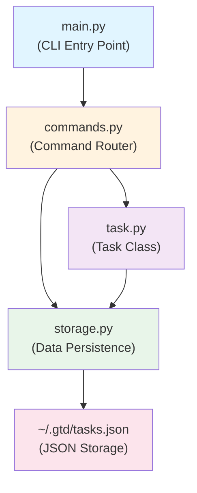

# 📋 SDD v1.0：GTD 任務管理工具

## 1. 專案概覽（Project Overview）

| 項目 | 內容 |
|---|---|
| **程式名稱** | GTD Task Manager |
| **版本** | v1.0 |
| **一句話描述** | 一個遵循 GTD（Getting Things Done）方法論的 CLI 任務管理工具，幫助使用者快速捕捉、澄清、組織和執行任務。 |
| **目標使用者** | 需要有效管理多個項目和任務的知識工作者、學生、創業家 |
| **核心價值** | 提供簡潔清晰的 CLI 界面，讓使用者專注於任務本身，而不是工具複雜度；遵循 GTD 四階段流程（捕捉→澄清→組織→執行） |

---

## 2. CLI 介面規格（Interface Specification）

### 指令總覽

GTD Task Manager 的所有操作都基於以下指令集：

```
python v1/main.py <command> [options]
```

> **執行方式**：從專案根目錄（`GTD Task Manager/`）執行，使用 `python v1/main.py`。
> 若已從 `v1/` 目錄執行，則使用 `python main.py`。

### 2.1 新增任務：`add`

**用途**：將任務快速捕捉至 inbox，是 GTD 流程的「捕捉」階段。

| 欄位 | 類型 | 必填 | 說明 |
|---|---|---|---|
| `--title TEXT` | string | ✅ | 任務名稱（無長度限制，但建議簡潔） |
| `--project TEXT` | string | ❌ | 專案名稱（可選，用於分類；若不提供，任務不屬於任何專案） |
| `--priority INT` | integer (1-5) | ❌ | 優先度等級，1=最低，5=最高，預設為 3 |

**行為**：
- 新任務自動進入 `inbox` 狀態
- 自動分配遞增的 ID（基於前一個任務的 ID+1）
- 記錄 `created_at` 和 `updated_at` 為當前時間

**範例**：
```bash
python v1/main.py add --title "完成 HW2 SDD 撰寫" --project "課程" --priority 4
# 輸出：✅ Added: [1] 完成 HW2 SDD 撰寫 (Project: 課程, Priority: 4)

python v1/main.py add --title "喝咖啡"
# 輸出：✅ Added: [2] 喝咖啡 (Priority: 3)
```

---

### 2.2 列出任務：`list`

**用途**：查看符合條件的任務清單，支援多維度篩選。

| 欄位 | 類型 | 必填 | 說明 |
|---|---|---|---|
| `--status TEXT` | string (inbox, next-action, waiting, done) | ❌ | 篩選任務狀態；若不提供，預設顯示 `inbox` 和 `next-action` 的所有任務 |
| `--project TEXT` | string | ❌ | 僅顯示指定專案的任務 |
| `--priority INT` | integer (1-5) | ❌ | 僅顯示指定優先度的任務 |
| `--all` | flag | ❌ | 無視狀態設定，顯示所有任務（包含 done）；與 `--status done` 等效 |

**行為**：
- 以表格格式輸出，包含欄位：`ID`, `Title`, `Project`, `Priority`, `Status`, `Created`
- 任務按 `priority` 遞減排序（優先度高的先出現），同優先度則按 ID 遞增
- 若無任務符合條件，輸出 `No tasks found.`

**範例**：
```bash
python v1/main.py list
# 輸出：
# ID   | Title                  | Project      | Priority | Status       | Created
# -----+------------------------+--------------+----------+--------------+-----------
# 1    | 完成 HW2 SDD 撰寫      | 課程         | 4        | next-action  | 2026-03-17
# 2    | 喝咖啡                 | (none)       | 3        | inbox        | 2026-03-17

python v1/main.py list --status done --all
# 輸出所有已完成的任務

python v1/main.py list --project "課程" --priority 4
# 輸出課程專案中優先度為 4 的任務
```

> **注意**：無 project 的任務顯示為 `(none)`。

---

### 2.3 更新任務：`update`

**用途**：修改任務的屬性（名稱、專案、優先度、狀態）。

| 欄位 | 類型 | 必填 | 說明 |
|---|---|---|---|
| `--id INT` | integer | ✅ | 任務的唯一識別碼 |
| `--title TEXT` | string | ❌ | 新的任務名稱 |
| `--project TEXT` | string | ❌ | 新的專案名稱 |
| `--no-project` | flag | ❌ | 移除專案關連（設為 null） |
| `--priority INT` | integer (1-5) | ❌ | 新的優先度（1-5） |
| `--status TEXT` | string (inbox, next-action, waiting, done) | ❌ | 新的狀態 |

**行為**：
- 若指定的 ID 不存在，輸出錯誤訊息並退出（exit code 1）
- 只更新有提供的欄位，其他欄位保持不變
- 更新 `updated_at` 為當前時間
- 成功更新後輸出 `✅ Updated: [ID] TITLE`

> **注意**：在 Windows PowerShell 中，`--project ""` 會被 shell 吃掉，導致 Click 報錯。
> 請改用 `--no-project` flag 來清除專案關連。

**範例**：
```bash
python v1/main.py update --id 1 --status next-action
# 輸出：✅ Updated: [1] 完成 HW2 SDD 撰寫

python v1/main.py update --id 1 --priority 5 --title "緊急：完成 HW2 SDD 撰寫"
# 輸出：✅ Updated: [1] 緊急：完成 HW2 SDD 撰寫

python v1/main.py update --id 1 --no-project
# 輸出：✅ Updated: [1] 緊急：完成 HW2 SDD 撰寫  （project 設為 null）

python v1/main.py update --id 999 --status done
# 輸出：❌ Error: Task [999] not found (exit code 1)
```

---

### 2.4 標記完成：`check`

**用途**：快速標記任務為完成（等同 `update --id X --status done`）。

| 欄位 | 類型 | 必填 | 說明 |
|---|---|---|---|
| `--id INT` | integer | ✅ | 任務的唯一識別碼 |

**行為**：
- 將任務狀態改為 `done`
- 若 ID 不存在，輸出錯誤訊息並退出（exit code 1）
- 成功完成後，輸出確認訊息

**範例**：
```bash
python v1/main.py check --id 1
# 輸出：✅ Completed: [1] 完成 HW2 SDD 撰寫

python v1/main.py check --id 999
# 輸出：❌ Error: Task [999] not found (exit code 1)
```

---

### 2.5 刪除任務：`remove`

**用途**：永久刪除任務（通常用於已完成或不再需要的任務）。

| 欄位 | 類型 | 必填 | 說明 |
|---|---|---|---|
| `--id INT` | integer | ✅ | 任務的唯一識別碼 |

**行為**：
- 刪除指定 ID 的任務
- 若 ID 不存在，輸出錯誤訊息並退出（exit code 1）
- 成功刪除後，輸出確認訊息
- **注意**：刪除操作不可復原

**範例**：
```bash
python v1/main.py remove --id 2
# 輸出：✅ Removed: [2]

python v1/main.py remove --id 999
# 輸出：❌ Error: Task [999] not found (exit code 1)
```

---

### 2.6 顯示任務詳情：`show`

**用途**：查看單一任務的完整資訊。

| 欄位 | 類型 | 必填 | 說明 |
|---|---|---|---|
| `--id INT` | integer | ✅ | 任務的唯一識別碼 |

**行為**：
- 顯示任務的所有欄位（ID、Title、Project、Priority、Status、Created、Updated）
- 以易於閱讀的格式輸出（鍵值對或簡單表格）
- 若 ID 不存在，輸出錯誤訊息並退出（exit code 1）

**範例**：
```bash
python v1/main.py show --id 1
# 輸出：
# Task [1]:
#   Title:     完成 HW2 SDD 撰寫
#   Project:   課程
#   Priority:  4
#   Status:    next-action
#   Created:   2026-03-17 14:30:22
#   Updated:   2026-03-17 14:35:10

python v1/main.py show --id 999
# 輸出：❌ Error: Task [999] not found (exit code 1)
```

---

### 2.7 幫助指令：`--help` / `help`

**用途**：顯示整體說明或特定指令的用法。

| 用法 | 說明 |
|---|---|
| `python v1/main.py --help` | 顯示所有可用指令的簡要說明 |
| `python v1/main.py <command> --help` | 顯示特定指令的詳細用法 |

**範例**：
```bash
python v1/main.py --help
# 輸出所有可用指令列表

python v1/main.py add --help
# 輸出：
# Usage: main.py add [OPTIONS]
#
# Options:
#   --title TEXT        Task title
#   --project TEXT      Project name
#   --priority INTEGER  Priority 1-5 (default: 3)
#   --help              Show this message and exit.
```

---

## 3. 資料模型（Data Model）

### Task 物件結構

所有任務都是 Task 物件的實例，具有以下欄位：

| 欄位 | 型別 | 必填 | 說明 | 備註 |
|---|---|---|---|---|
| `id` | int | ✅ | 唯一識別碼，自動遞增 | 從 1 開始，每新增一個任務 +1 |
| `title` | str | ✅ | 任務名稱 | 長度無限制；不可為空字串 |
| `project` | str (or null) | ❌ | 專案名稱 | 可為 null（表示不屬於任何專案） |
| `priority` | int | ✅ | 優先度等級 | 範圍 1-5；預設 3 |
| `status` | str | ✅ | 任務狀態 | 四個狀態之一：`inbox`, `next-action`, `waiting`, `done` |
| `created_at` | datetime | ✅ | 建立時間 | ISO 8601 格式，精確到秒 |
| `updated_at` | datetime | ✅ | 最後修改時間 | ISO 8601 格式，與 `created_at` 初始值相同 |

### 四個任務狀態詳解

| 狀態 | 定義 | 何時使用 | 典型流向 |
|---|---|---|---|
| **inbox** | 新捕捉的任務，尚未澄清或決定 | 快速捕捉新想法、臨時任務 | → `next-action` 或 `waiting` |
| **next-action** | 已澄清且可立即執行的任務 | 決定這是下一步該做的事 | → `done` |
| **waiting** | 需等待外部條件或他人回應 | 等待回覆、依賴其他任務完成 | → `next-action` 或 `done` |
| **done** | 已完成的任務 | 標記完成後的存檔 | （終態）|

### JSON 儲存格式

任務以 JSON 陣列形式儲存在 `~/.gtd/tasks.json`：

```json
{
  "tasks": [
    {
      "id": 1,
      "title": "完成 HW2 SDD 撰寫",
      "project": "課程",
      "priority": 4,
      "status": "next-action",
      "created_at": "2026-03-17T14:30:22",
      "updated_at": "2026-03-17T14:35:10"
    },
    {
      "id": 2,
      "title": "喝咖啡",
      "project": null,
      "priority": 3,
      "status": "inbox",
      "created_at": "2026-03-17T14:40:00",
      "updated_at": "2026-03-17T14:40:00"
    }
  ],
  "next_id": 3
}
```

---

## 4. 模組架構（Module Design）

### 模組結構圖



### 各模組職責說明

#### `main.py`（CLI 進入點，80-100 行）

**責任**：
- 解析命令列參數（使用 `click` 或 `typer` library）
- 路由至相應的指令處理函式
- 處理全局錯誤和退出碼

**關鍵函式**：
```python
def main():
    """GTD Task Manager CLI entry point"""
    # 命令路由邏輯
    pass

if __name__ == "__main__":
    main()
```

---

#### `commands.py`（命令邏輯，150-200 行）

**責任**：
- 實作每個 CLI 指令的業務邏輯（add, list, update, check, remove, show）
- 調用 Task 和 Storage 模組
- 格式化和輸出結果

**關鍵函式**：
```python
def add_task(title: str, project: str = None, priority: int = 3) -> Task:
    """新增任務至 inbox"""
    pass

def list_tasks(status: str = None, project: str = None, priority: int = None) -> List[Task]:
    """列出任務，支援篩選"""
    pass

def update_task(task_id: int, **kwargs) -> Task:
    """更新任務屬性"""
    pass

def check_task(task_id: int) -> Task:
    """標記任務完成"""
    pass

def remove_task(task_id: int) -> None:
    """刪除任務"""
    pass

def show_task(task_id: int) -> Task:
    """顯示任務詳情"""
    pass
```

---

#### `task.py`（資料模型，40-50 行）

**責任**：
- 定義 Task 類別和其屬性
- 提供任務的驗證邏輯（例：priority 必須在 1-5 之間）

**關鍵類別**：
```python
from datetime import datetime
from typing import Optional

class Task:
    def __init__(self, id: int, title: str, project: Optional[str] = None, 
                 priority: int = 3, status: str = "inbox",
                 created_at: datetime = None, updated_at: datetime = None):
        self.id = id
        self.title = title
        self.project = project
        self.priority = priority
        self.status = status
        self.created_at = created_at or datetime.now()
        self.updated_at = updated_at or datetime.now()
    
    def validate(self) -> bool:
        """驗證任務屬性合法性"""
        return 1 <= self.priority <= 5 and self.status in ["inbox", "next-action", "waiting", "done"]
    
    def to_dict(self) -> dict:
        """轉換為 JSON 相容格式"""
        pass
```

---

#### `storage.py`（資料持久化，60-80 行）

**責任**：
- JSON 檔案的讀寫
- 管理 next_id（自動遞增）
- 提供高層次的 save/load 介面

**關鍵函式**：
```python
def load_tasks() -> dict:
    """從 JSON 檔案讀取所有任務"""
    pass

def save_tasks(data: dict) -> None:
    """將任務寫入 JSON 檔案"""
    pass

def get_next_id() -> int:
    """取得下一個可用的 Task ID"""
    pass
```

---

## 5. 錯誤處理規格（Error Handling）

### 錯誤分類與退出碼

| 錯誤情景 | 預期輸出 | 退出碼 |
|---|---|---|
| **ID 不存在** | `❌ Error: Task [ID] not found` | 1 |
| **缺少必填參數** | `❌ Error: --title is required` | 2 |
| **無效的優先度** | `❌ Error: Priority must be between 1 and 5` | 2 |
| **無效的狀態值** | `❌ Error: Invalid status. Valid values are: inbox, next-action, waiting, done` | 2 |
| **JSON 檔案損壞** | `❌ Error: Failed to load tasks. Data file may be corrupted.` | 3 |
| **無法建立目錄** | `❌ Error: Cannot create ~/.gtd directory` | 3 |
| **指令不存在** | `❌ Error: Unknown command 'xyz'. Use 'gtd --help' for usage.` | 2 |
| **正常執行** | 各指令的成功輸出 | 0 |

### 錯誤訊息格式規範

- 所有錯誤以 `❌ Error:` 開頭（便於用戶識別）
- 成功訊息以 `✅` 或具體動詞開頭（如 `Added:`, `Updated:`, `Removed:`）
- 錯誤訊息應具體指出問題和可能的解決方案

---

## 6. 測試案例（Test Cases）

所有測試案例假設環境初始狀態為 **空任務列表**（無既有任務）。

### 前置條件

- 執行 `gtd` 指令前，已確保 Python 環境正確設置
- 執行 `pip install -r requirements.txt` 安裝依賴
- `~/.gtd/` 目錄為空或不存在（程式應自動建立）

### 測試案例表格

| # | 指令 | 前置狀態 | 預期輸出 | 預期退出碼 | 驗證方法 |
|---|---|---|---|---|---|
| **T1** | `python v1/main.py add --title "Task A"` | 空列表 | `✅ Added: [1] Task A (Priority: 3)` | 0 | stdout 包含 "Added" 且 ID=1 |
| **T2** | `python v1/main.py add --title "Task B" --project "Work" --priority 5` | 已有 1 個任務 | `✅ Added: [2] Task B (Project: Work, Priority: 5)` | 0 | stdout 包含 "Added" 且 ID=2 |
| **T3** | `python v1/main.py list` | 有 2 個任務（T1、T2） | 表格輸出含 2 列，Task B 優先度 5 在上 | 0 | stdout 包含兩個任務名稱，優先度排序正確 |
| **T4** | `python v1/main.py list --status inbox` | 有 2 個任務均為 inbox | 表格輸出含 2 列 | 0 | stdout 包含兩個任務 |
| **T5** | `python v1/main.py list --project "Work"` | Task B 屬於 "Work" 專案 | 表格輸出含 1 列（Task B） | 0 | stdout 只含 Task B |
| **T6** | `python v1/main.py update --id 1 --status next-action` | Task A 狀態為 inbox | `✅ Updated: [1] Task A` | 0 | stdout 確認更新，執行 show --id 1 驗證狀態變更 |
| **T7** | `python v1/main.py update --id 1 --priority 4 --title "Task A - Updated"` | Task A 已有，ID=1 | `✅ Updated: [1] Task A - Updated` | 0 | stdout 確認更新，執行 show --id 1 驗證新標題 |
| **T8** | `python v1/main.py show --id 1` | Task A 已存在 | 鍵值對格式顯示 ID、Title、Project、Priority、Status、Created、Updated | 0 | stdout 包含完整欄位資訊 |
| **T9** | `python v1/main.py check --id 2` | Task B 狀態為 inbox 或 next-action | `✅ Completed: [2] Task B` | 0 | stdout 確認完成，執行 show --id 2 驗證狀態為 done |
| **T10** | `python v1/main.py list --all` | 有 1 個 done 任務、1 個 next-action 任務 | 表格輸出含 2 列 | 0 | stdout 包含 done 和 next-action 任務 |
| **T11** | `python v1/main.py remove --id 2` | Task B 已存在 | `✅ Removed: [2]` | 0 | stdout 確認移除，執行 list --all 驗證任務不存在 |
| **T12** | `python v1/main.py show --id 999` | 任務不存在 | `❌ Error: Task [999] not found` | 1 | stdout 包含 "Error" 和 "not found"，退出碼為 1 |
| **T13** | `python v1/main.py add --project "Personal"` | 無其他參數 | `❌ Error: --title is required` | 2 | stdout 包含 "Error" 和 "required"，退出碼為 2 |
| **T14** | `python v1/main.py add --title "Task C" --priority 6` | 無效優先度 | `❌ Error: Priority must be between 1 and 5` | 2 | stdout 包含 "Error" 和 "Priority"，退出碼為 2 |
| **T15** | `python v1/main.py update --id 1 --status invalid-status` | 無效狀態 | `❌ Error: Invalid status. Valid values are: inbox, next-action, waiting, done` | 1 | stdout 包含 "Error" 和 "Invalid status"，退出碼為 1 |
| **T16** | `python v1/main.py --help` | 任何狀態 | 列出所有可用指令（add, list, update, check, remove, show） | 0 | stdout 包含所有指令名稱 |
| **T17** | `python v1/main.py add --help` | 任何狀態 | 顯示 add 指令的使用方式與所有選項 | 0 | stdout 包含 --title、--project、--priority 等選項說明 |
| **T18** | `python v1/main.py list --priority 5` | 有優先度為 5 的任務 | 表格輸出含該任務 | 0 | stdout 包含優先度 5 的任務 |
| **T19** | `python v1/main.py list` 不帶任何篩選 | 有 inbox 和 next-action 任務 | 只顯示 inbox 和 next-action，不顯示 done | 0 | stdout 不含 done 任務 |
| **T20** | `python v1/main.py update --id 1 --no-project` | Task 1 有 project 值 | `✅ Updated: [1] ...` (project 設為 null) | 0 | 執行 show --id 1 驗證 Project 顯示為 (none) |

---

## 7. 約束與邊界條件

### 資料完整性約束

- **任務 ID 連續性**：ID 必須從 1 開始自動遞增，不允許 ID 間隙（除非任務被刪除）
  - 例：若刪除 ID=2，新任務應為 ID=3（不能跳回 ID=2）
- **唯一性**：每個 Task 的 ID 全局唯一
- **優先度範圍**：必須嚴格限制在 1-5，否則拒絕

### 效能限制（v1.0 無特殊要求）

- 任務數量預期在 100-1000 個範圍（JSON 足夠應付）
- 單條指令應在 1 秒內完成
- 若任務數量超過 1000 個，v2.0 可考慮升級至資料庫

### 檔案系統行為

- 若 `~/.gtd/` 不存在，程式應自動建立該目錄
- 若 `tasks.json` 不存在，應建立空的有效 JSON 結構（`{"tasks": [], "next_id": 1}`）
- 檔案操作失敗應輸出清晰的錯誤訊息並退出

---

## 8. 向下相容性預留設計（為 v2.0 做準備）

### 資料模型的可擴展性

目前 Task 的 JSON 結構故意簡潔，但在以下方面預留了擴展空間：

| 欄位 | v1.0 用途 | v2.0 可能擴展 |
|---|---|---|
| `id`, `title`, `status` | 核心功能 | （保持不變） |
| `created_at`, `updated_at` | 時間戳 | 支援按時間篩選、生成回顧報告 |
| `project` | 分類 | 支援專案層級統計、顏色標籤 |
| `priority` | 優先排序 | 支援時間線規劃、自動優先度調整 |
| （未使用） | — | v2.0 可新增：due_date、recurring、subtasks、tags 等 |

### CLI 設計的可擴展性

- **命令名稱凍結**：v1.0 的所有指令（add, list, update, check, remove, show）在 v2.0 中保持相同名稱和參數
- **參數向後相容**：v1.0 的 flag 不可刪除或改名，只能新增
- **子命令預留**：未來可支援 `gtd project list`, `gtd review`, `gtd report` 等新指令，不會影響現有指令

---

## 9. 依賴與技術棧

### 必要套件

| 套件 | 版本 | 用途 |
|---|---|---|
| `click` 或 `typer` | 最新穩定版 | CLI 命令列解析與路由 |
| `Python` | 3.10+ | 執行環境 |

### 可選套件

| 套件 | 用途 |
|---|---|
| `pytest` | 單元測試（開發用） |
| `black` | 程式碼格式化（開發用） |

### 環境變數

- 任務檔案存儲位置：`~/.gtd/tasks.json`（硬寫，不可配置）

---

## 10. 版本控制與迭代計畫

### v1.0 目標

- ✅ 實作 GTD 四階段中的「捕捉→澄清→組織→執行」
- ✅ 支援任務的基本 CRUD 操作
- ✅ 簡潔清晰的 CLI 介面
- ✅ JSON 本地儲存

### v2.0 預期擴展方向（由 AI 決定）

根據課程規劃，v2.0 需求將由 Agent 自動生成，可能包括但不限於：
- 時間管理（due_date, recurring tasks）
- 習慣追蹤
- 統計分析與回顧
- TUI 視覺化介面
- 資料庫升級（SQLite）
- 多使用者支援

---

*SDD v1.0 撰寫日期：2026-03-17*
*v1.0 實作完成日期：2026-03-17*
*下一階段：v2.0 功能擴展（due_date、統計報告、TUI 等）*
