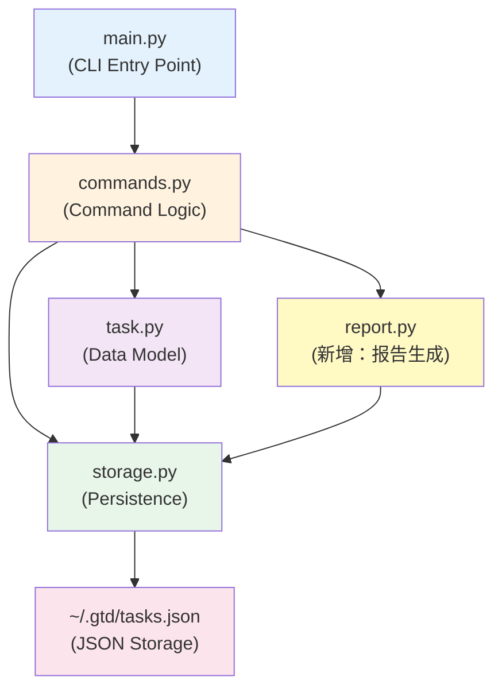

# 📋 SDD v2.0：GTD Task Manager 升级版

> **版本**：v2.0
> **基于**：v1.0 向下相容
> **生成时间**：2026-03-21
> **需求来源**：`v2/requirements_v2.md` (TA Agent 生成)

---

## 1. 专案概览

| 项目 | 内容 |
|---|---|
| **项目名称** | GTD Task Manager v2.0 |
| **版本** | v2.0 |
| **核心改进** | 加入截止日期管理、工作回顾统计、批次删除确认 |
| **向下相容性** | ✅ 完全相容 v1.0 的所有指令和数据 |
| **目标用户** | 需要时间管理和工作统计的知识工作者 |

---

## 2. CLI 接口规格

### 2.1 新增参数概览

| 指令 | 新增参数 | 说明 |
|---|---|---|
| `add` | `--due DATE` | 设定截止日期（可选） |
| `update` | `--due DATE` | 修改截止日期（可选） |
| `update` | `--no-due` | 清除截止日期 |
| `list` | `--due-before DATE` | 按截止日期前筛选 |
| `remove` | `--id INT` (多个) | 支持批次删除 |
| `remove` | `--force` | 跳过确认步骤 |
| `report` | (新命令) | 统计报告 |

---

## 3. 详细命令规范

### 3.1 `add` 指令（扩展）

**新增参数**：
```
--due TEXT (可选)  截止日期
```

**日期格式**：`YYYY-MM-DD`（例：2026-03-31）

**行为**：
- 如果不提供 `--due`，任务的 `due_date` 为 null
- 如果提供，验证日期格式，格式错误时抛出错误
- 日期可以是过去、现在或未来

**示例**：
```bash
# 不带截止日期（v1.0 兼容）
gtd add --title "Task A"

# 带截止日期
gtd add --title "Report" --due 2026-03-31

# 组合所有参数
gtd add --title "Project" --project "Work" --priority 5 --due 2026-04-15
```

**输出**：
```
✅ Added: [1] Task A (Priority: 3, Due: (none))
✅ Added: [2] Report (Priority: 3, Due: 2026-03-31)
```

---

### 3.2 `update` 指令（扩展）

**新增参数**：
```
--due TEXT (可选)     修改截止日期
--no-due (flag)       清除截止日期（等同 --due null）
```

**行为**：
- `--due DATE`：设定新的截止日期
- `--no-due`：将 due_date 设为 null
- 如果都不提供，due_date 保持不变

**冲突处理**：
- 如果同时传 `--due` 和 `--no-due`，抛出错误："Cannot specify both --due and --no-due"

**示例**：
```bash
# 添加截止日期
gtd update --id 1 --due 2026-03-31

# 清除截止日期
gtd update --id 1 --no-due

# 修改其他字段时保持截止日期
gtd update --id 1 --priority 5
```

**输出**：
```
✅ Updated: [1] Task A (Due: 2026-03-31)
✅ Updated: [1] Task A (Due: (none))
```

---

### 3.3 `show` 指令（扩展）

**新增输出**：
- 原有所有字段保持不变
- 新增一行：`Due: YYYY-MM-DD` 或 `Due: (none)`

**示例输出**：
```
Task [1]:
  Title:     Task A
  Project:   (none)
  Priority:  3
  Status:    next-action
  Due:       2026-03-31
  Created:   2026-03-17 15:16:15
  Updated:   2026-03-17 15:16:17
```

---

### 3.4 `list` 指令（扩展）

#### 新增参数

```
--due-before DATE (可选)  只显示截止日期在该日期当天或之前的任务
```

#### 表格新增列

原有列：`ID | Title | Project | Priority | Status | Created`

新增列：`Due`（在 Status 和 Created 之间）

完整格式：
```
ID | Title | Project | Priority | Status | Due | Created
```

#### 逾期警示

- **定义**：截止日期 < 今天 AND 状态 != done
- **视觉标记**：在该任务前加 `⚠️` 或 `[OVERDUE]` 标记
- **优先显示**：逾期任务应排在最前面（排序调整）

#### 排序规则（v2.0 新规则）

优先级顺序（从高到低）：
1. 逾期状态（已过期 > 未过期）
2. 优先度（5 → 1）
3. 截止日期（最近 → 最远）
4. ID（升序）

#### 示例

```bash
# 显示截止日期在 2026-03-31 之前的任务
gtd list --due-before 2026-03-31

# 组合多个筛选条件
gtd list --project "Work" --due-before 2026-03-31 --status next-action

# 默认行为（不带 --due-before，显示所有有截止日期的任务）
gtd list
```

**输出示例**：
```
ID | Title         | Project | Priority | Status      | Due        | Created
──────────────────────────────────────────────────────────────────────────
⚠️ 2 | Urgent report | Work    | 5        | next-action | 2026-03-20 | 2026-03-17
   1 | Task A        | (none)  | 4        | inbox       | 2026-03-31 | 2026-03-17
   3 | Task B        | (none)  | 3        | inbox       | (none)     | 2026-03-17
```

---

### 3.5 `report` 指令（全新）

**参数**：
```
--project TEXT (可选)  限制报告范围至指定专项
```

**功能**：统计整体工作状况

**输出结构**：

#### A. 整体概览（Inbox Status Overview）
```
=== Inbox Status Overview ===
inbox:       3 tasks
next-action: 5 tasks
waiting:     2 tasks
done:        8 tasks
────────────────────
Total:      18 tasks
```

#### B. 专项分布（Project Distribution）
```
=== Project Distribution ===

Work:
  inbox:       1 tasks
  next-action: 2 tasks
  waiting:     1 tasks
  done:        3 tasks
  Subtotal:    7 tasks

Personal:
  inbox:       2 tasks
  next-action: 2 tasks
  waiting:     0 tasks
  done:        2 tasks
  Subtotal:    6 tasks

(no project):
  inbox:       0 tasks
  next-action: 1 task
  waiting:     1 task
  done:        3 tasks
  Subtotal:    5 tasks
```

#### C. 逾期警示（Overdue Alert）
```
=== Overdue Alert ===
⚠️  Found 2 overdue tasks (not done):
  [1] Task name - Due: 2026-03-20
  [5] Another task - Due: 2026-03-15

Take action now!
```

或若无逾期任务：
```
=== Overdue Alert ===
✅ No overdue tasks. Great job!
```

#### D. 使用 --project 筛选

```bash
gtd report --project "Work"
```

**输出**：仅显示 Work 专项的统计数据（可选显示全局对比）

---

### 3.6 `remove` 指令（扩展）

#### 新增参数和语法

**原有**：
```
--id INT  删除指定 ID 的任务
```

**扩展后**：
```
--id INT (可以多个)   例：--id 1 --id 3 --id 5
--force (flag)        跳过确认步骤
```

#### 删除流程

**不带 --force 时**：
1. 接收要删除的 ID 列表
2. 检查哪些 ID 存在，哪些不存在
3. 列出将被删除的任务清单
4. 提示用户："Delete these tasks? (y/n)"
5. 等待用户输入
6. 根据用户输入执行或取消

**带 --force 时**：
1. 接收要删除的 ID 列表
2. 直接删除所有存在的 ID
3. 跳过确认步骤
4. 输出最终结果

#### 错误处理

- 如果传入的 ID 中有部分不存在：
  - 不带 --force：询问用户是否继续删除存在的部分
  - 带 --force：跳过不存在的 ID，继续删除存在的，最后汇总输出

#### 示例

**场景 1：删除单个任务（无确认）**
```bash
gtd remove --id 1
```

**输出**：
```
Are you sure you want to delete these tasks?
  [1] Task A

Delete? (y/n): y
✅ Removed: [1]
```

**场景 2：批次删除（有确认）**
```bash
gtd remove --id 1 --id 3 --id 5
```

**输出**：
```
Are you sure you want to delete these tasks?
  [1] Task A
  [3] Task C
  [5] Task E

Delete? (y/n): y
✅ Removed: [1], [3], [5]
```

**场景 3：批次删除（部分 ID 不存在）**
```bash
gtd remove --id 1 --id 999 --id 3
```

**输出**：
```
⚠️  ID 999 not found.

Are you sure you want to delete these tasks?
  [1] Task A
  [3] Task C

Delete the existing ones? (y/n): y
✅ Removed: [1], [3]
⚠️  Skipped: [999] (not found)
```

**场景 4：使用 --force 跳过确认**
```bash
gtd remove --id 1 --id 3 --force
```

**输出**：
```
✅ Removed: [1], [3]
```

**场景 5：用户取消删除**
```bash
gtd remove --id 1 --id 3
```

**输出**：
```
Are you sure you want to delete these tasks?
  [1] Task A
  [3] Task C

Delete? (y/n): n
❌ Cancelled. No tasks were deleted.
```

---

## 4. 数据模型（扩展）

### Task 类扩展

新增字段：

| 字段 | 类型 | 说明 | v1.0 兼容 |
|---|---|---|---|
| `due_date` | date or null | 截止日期 (YYYY-MM-DD) | ✅ 读取旧数据时默认 null |

**完整字段列表**：
```python
Task:
  - id (int)
  - title (str)
  - project (str or null)
  - priority (int, 1-5)
  - status (str)
  - due_date (date or null)  [新增]
  - created_at (datetime)
  - updated_at (datetime)
```

### JSON 序列化格式

```json
{
  "tasks": [
    {
      "id": 1,
      "title": "Task A",
      "project": "Work",
      "priority": 5,
      "status": "next-action",
      "due_date": "2026-03-31",
      "created_at": "2026-03-17T15:16:15",
      "updated_at": "2026-03-17T15:16:17"
    },
    {
      "id": 2,
      "title": "Old Task (from v1.0)",
      "project": null,
      "priority": 3,
      "status": "inbox",
      "due_date": null,
      "created_at": "2026-03-15T10:00:00",
      "updated_at": "2026-03-15T10:00:00"
    }
  ],
  "next_id": 3
}
```

### 向下相容性

**读取 v1.0 数据**：
- 如果任务 JSON 中缺少 `due_date` 字段，自动设为 `null`
- 现有任务的所有行为保持不变

**写入数据**：
- 所有新增任务都必须有 `due_date` 字段（可为 null）

---

## 5. 模块架构（v2.0）

### 架构图



### 新增模块：report.py

**职责**：
- 计算各状态任务数
- 统计各专项分布
- 识别逾期任务
- 格式化输出报告

**关键方法**：
```python
def generate_report(tasks: List[Task], project: Optional[str] = None) -> str:
    """生成统计报告"""
    pass

def get_overdue_tasks(tasks: List[Task]) -> List[Task]:
    """获取逾期任务列表"""
    pass

def get_project_distribution(tasks: List[Task]) -> Dict[str, Dict[str, int]]:
    """获取各专项的状态分布"""
    pass
```

### 修改模块

**task.py**：
- 新增 `due_date` 字段
- 修改 `validate()` 验证日期格式
- 修改 `to_dict()` / `from_dict()` 序列化日期

**storage.py**：
- 修改 `load_tasks()` 处理向下相容（缺失 due_date 字段）
- 修改 `save_tasks()` 保存 due_date

**commands.py**：
- 修改 `add_task()` 支持 due_date 参数
- 修改 `list_tasks()` 支持 --due-before 筛选和排序调整
- 修改 `update_task()` 支持 due_date 修改
- 修改 `remove_task()` 支持批次删除和确认
- 新增 `generate_report()` 方法

**main.py**：
- 修改 `add` 命令加入 --due 选项
- 修改 `update` 命令加入 --due 和 --no-due 选项
- 修改 `list` 命令加入 --due-before 选项，调整表格列
- 修改 `remove` 命令支持多 --id 和 --force
- 新增 `report` 命令

---

## 6. 错误处理规范

### 新增错误类型

| 错误 | 输出 | 退出码 |
|---|---|---|
| 日期格式错误 | `❌ Error: Invalid date format. Expected YYYY-MM-DD` | 2 |
| --due 和 --no-due 同时使用 | `❌ Error: Cannot specify both --due and --no-due` | 2 |
| 部分 ID 不存在（删除） | `⚠️ ID 999 not found.` (继续询问) | 0 (询问后) |
| 用户取消删除 | `❌ Cancelled. No tasks were deleted.` | 0 |

### 保持一致性

- 所有新增参数的错误都用 "❌ Error:" 格式
- 日期验证失败时给出具体的格式说明

---

## 7. 向下相容性说明

### v1.0 保留的接口

所有 v1.0 的指令和参数**完全保持不变**：

| 指令 | v1.0 参数 | v2.0 行为 | 相容性 |
|---|---|---|---|
| `add` | --title, --project, --priority | 新增可选 --due，不提供时为 null | ✅ |
| `list` | --status, --project, --priority, --all | 新增可选 --due-before，表格新增 Due 列 | ✅ |
| `update` | --id, --title, --project, --priority, --status | 新增 --due 和 --no-due，不提供时不改变 | ✅ |
| `check` | --id | 行为不变 | ✅ |
| `show` | --id | 输出新增 Due 行 | ✅ |
| `remove` | --id | 新增批次支持和确认，行为兼容 | ✅ |
| `report` | (新命令) | 全新功能 | ✅ |

### 迁移策略

**v1.0 → v2.0 数据迁移**：
- 无需迁移脚本
- v2.0 自动处理：读取 v1.0 的 tasks.json，缺失 due_date 字段时设为 null
- 现有任务的所有行为和输出格式保持不变（除新增的 Due 列）

---

## 8. 测试案例

### 截止日期相关 (T1-T10)

```bash
# T1: add 不带截止日期（v1.0 兼容）
python v1/main.py add --title "Task A"
# 预期：✅ Added: [1] Task A (Priority: 3)

# T2: add 带截止日期
python v1/main.py add --title "Report" --due 2026-03-31
# 预期：✅ Added: [2] Report (Due: 2026-03-31)

# T3: show 显示截止日期
python v1/main.py show --id 2
# 预期：Due: 2026-03-31

# T4: update 添加截止日期
python v1/main.py update --id 1 --due 2026-04-15
# 预期：✅ Updated: [1] Task A (Due: 2026-04-15)

# T5: update 清除截止日期
python v1/main.py update --id 1 --no-due
# 预期：✅ Updated: [1] Task A (Due: (none))

# T6: add 日期格式错误
python v1/main.py add --title "Bad" --due 2026/03/31
# 预期：❌ Error: Invalid date format. Expected YYYY-MM-DD

# T7: list 显示 Due 列
python v1/main.py list
# 预期：表格包含 Due 列

# T8: list --due-before 筛选
python v1/main.py list --due-before 2026-03-31
# 预期：只显示截止日期在 2026-03-31 当天或之前的任务

# T9: list 显示逾期警示
python v1/main.py add --title "Overdue" --due 2026-03-01
python v1/main.py list
# 预期：该任务前有 ⚠️ 标记

# T10: 向下相容性（v1.0 数据）
# 使用 v1.0 生成的 tasks.json，所有命令都能正常运行
python v1/main.py list
# 预期：无错误，显示所有 v1.0 任务，Due 列为 (none)
```

### report 指令 (T11-T14)

```bash
# T11: report 基本输出
python v1/main.py report
# 预期：显示整体概览、专项分布、逾期警示

# T12: report --project 筛选
python v1/main.py report --project "Work"
# 预期：仅显示 Work 专项的统计

# T13: report 无逾期任务
python v1/main.py report
# 预期：显示 "✅ No overdue tasks"

# T14: report 有逾期任务
python v1/main.py add --title "Late" --due 2026-03-01
python v1/main.py report
# 预期：显示 "⚠️ Found X overdue tasks"
```

### remove 批次删除 (T15-T20)

```bash
# T15: remove 单个任务（带确认）
python v1/main.py remove --id 1
# 预期：显示确认提示，用户输入 y/n

# T16: remove 批次删除
python v1/main.py remove --id 1 --id 3 --id 5
# 预期：显示 3 个任务的确认列表

# T17: remove 用户取消
python v1/main.py remove --id 1
# 用户输入：n
# 预期：❌ Cancelled. No tasks were deleted.

# T18: remove --force 跳过确认
python v1/main.py remove --id 1 --force
# 预期：✅ Removed: [1]（无确认步骤）

# T19: remove 部分 ID 不存在
python v1/main.py remove --id 1 --id 999
# 预期：⚠️ ID 999 not found. / 询问是否继续

# T20: remove --force 部分不存在
python v1/main.py remove --id 1 --id 999 --force
# 预期：✅ Removed: [1] / ⚠️ Skipped: [999] (not found)
```

### 其他 v2.0 特性 (T21-T25)

```bash
# T21: list 组合多个筛选
python v1/main.py list --project "Work" --due-before 2026-03-31 --status next-action
# 预期：同时满足三个条件的任务

# T22: list 排序优先级（逾期 > 优先度 > 截止日期）
python v1/main.py list --all
# 预期：逾期任务最前，然后按优先度和截止日期排序

# T23: add 组合所有参数
python v1/main.py add --title "Full" --project "P" --priority 5 --due 2026-04-01
# 预期：✅ Added: [X] Full (Project: P, Priority: 5, Due: 2026-04-01)

# T24: update --due 和 --no-due 冲突
python v1/main.py update --id 1 --due 2026-04-01 --no-due
# 预期：❌ Error: Cannot specify both --due and --no-due

# T25: v1.0 数据完全兼容
# 删除 ~/.gtd/tasks.json，使用 v1.0 的 tasks.json
# 所有 v2.0 命令都能正常运行，无错误
python v1/main.py list --due-before 2026-12-31
# 预期：无错误，Due 列为 (none)
```

---

## 9. 约束与限制

### 截止日期格式

- **格式**：`YYYY-MM-DD`（必须严格）
- **范围**：任意合法日期（过去、现在、未来均可）
- **特殊值**：不支持相对日期（如 "tomorrow"），只支持绝对日期

### 批次删除限制

- 一次 remove 指令可删除的 ID 数量无硬性限制
- 但建议 UI 提示不超过 10 个任务（防止误操作）

### report 输出格式

- 不强制特定的视觉样式，学生可自由设计
- 需要保证清晰易读

---

## 10. 向下相容性详细说明

### 场景 1：v1.0 用户升级到 v2.0

1. 现有 `~/.gtd/tasks.json` 保持不变，无需修改
2. v2.0 读取时自动为缺失 due_date 的任务设为 null
3. 所有 v1.0 指令完全兼容
4. 新增的 Due 列显示为 (none)

### 场景 2：v2.0 添加截止日期后回到 v1.0

1. v1.0 不认识 due_date 字段
2. v1.0 会忽略该字段，继续正常工作
3. 所有功能保持一致

### 场景 3：验证向下相容性

测试脚本：
```bash
# 1. 使用 v1.0 生成 tasks.json
cd v1/
python main.py add --title "V1 Task"
cd ..

# 2. 用 v2.0 读取
cd v2/
python main.py list
python main.py show --id 1

# 3. v2.0 添加截止日期
python main.py update --id 1 --due 2026-03-31
python main.py show --id 1

# 4. 验证 JSON 格式
cat ~/.gtd/tasks.json
```

**预期结果**：
- 无任何错误
- v1.0 任务的 due_date 为 null
- 修改后的任务有 due_date 值

---

## 11. 版本控制注意事项

### v1.0 文件锁定

⚠️ **禁止修改 v1/ 目录内的文件**

- v1/task.py（冻结）
- v1/storage.py（冻结）
- v1/commands.py（冻结）
- v1/main.py（冻结）
- v1/sdd_v1.md（冻结）

所有扩展必须在 v2/ 中新增或修改。

### v2 文件结构

```
v2/
├── __init__.py
├── task.py (扩展 v1.0 的 Task 类)
├── storage.py (扩展 v1.0 的 TaskStorage)
├── commands.py (扩展 v1.0 的 TaskManager)
├── report.py (新增：报告生成模块)
├── main.py (扩展 v1.0 的 CLI)
└── requirements.txt (如需要扩展库)
```

---

*SDD v2.0 撰写日期：2026-03-21*
*下一步骤：根据本 SDD 实现 v2.0 代码和完整 README.md*
